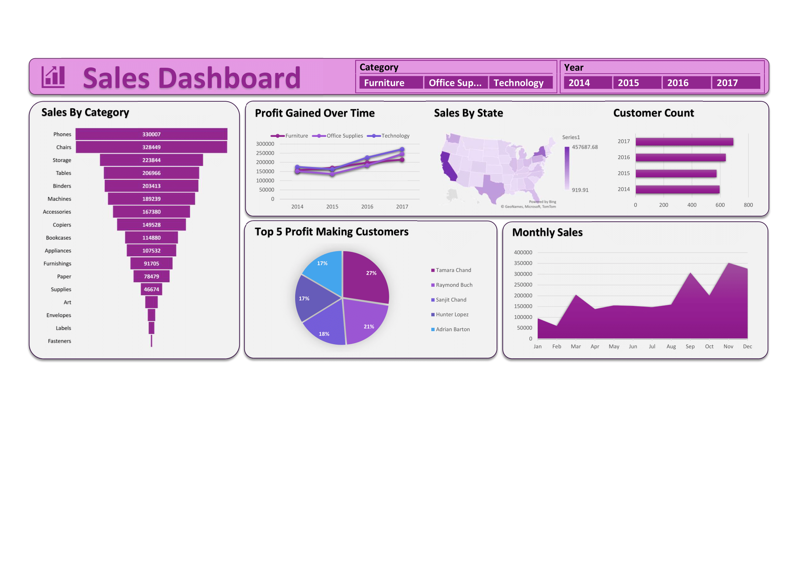

# US-Sales-Data-Analysis-On-Excel
_A client has shared a sales dataset and seeks insights, including sales trends over time, state-wise sales comparison, monthly sales analysis, identifying top-profit customers, and evaluating product category performance._

## Author
- [@saadharoon27](https://github.com/saadharoon27)

## Table of Contents
- [Business Problem](#business-problem)
- [Data Source](#data-source)
- [Data Overview](#data-overview)
- [Method](#method)
- [Quick Glance At The Dashboard](#quick-glance-at-the-dashboard)
- [Data Cleaning and Manipulation](#data-cleaning-and-manipulation)
- [Dashboarding](#dashboarding)
- [Slicers](#slicers)
  
## Business Problem
**Business Problem Statement:**  
A client has provided their sales dataset and requested insights from the data, focusing on several factors such as changes in sales orders over the years, a comparison of sales data across different states, monthly sales volume analysis, identification of top-profit-generating customers, and an evaluation of the performance of various product categories

## Data Source
- [US Store Sales Dataset](https://www.kaggle.com/datasets/saadharoon27/us-store-sales-dataset)

## Data Overview
| **Column Name**     	            | **Description**     |
|-------------------	              |------------------	  |
| **Order Date**     	              | Consists the date on which a specific order was created |
| **Customer Name**    	            | Consists the full name of the customer who created an order|
| **State**               	        | Name of the state the customer belonged to|
| **Category**     	                | Which category did the ordered product belong to |
| **Sub-Category**    	            | Name of the sub-category of the ordered product|
| **Product Name**               	  | Name of the ordered product|
| **Sales**     	                  | The price at which the product was sold|
| **Quantity**    	                | Number of quantities the customer ordered of that product|
| **Profit**               	        | How much did the firm make in that transaction|

## Method
- Exploratory data analysis _(EDA)_

## Quick Glance At The Dashboard

## Data Cleaning and Manipulation
To create efficient pivot tables and dashboards with the provided data, the initial step involved converting the data into a structured table named _‘SalesData’_ using the **"create table"** option. This transformation enhances data organization, making it more conducive for effective analysis and visualization. 

**Column Treatment and Adjustments:** 
- 1.	**Sales Column:** The _‘Sales’ column_ was in a general format, which could have potentially cause issues when creating visual representations. To ensure smooth visual plotting, it was necessary to convert the values into a **Number format.**
- 2.	**Quantity Column:** The same goes for the _‘Quantity’ column_, removed the decimal places.
- 3.	**Profit Column:** And the _‘Profit’ column_.
- 4.	**Order Date Column:** The _'Order Date' column_ was converted into a date format and subsequently organized in ascending order, from the oldest dates to the most recent ones. This action ensures that the data is chronologically arranged.
- 5.	**Month Column:** A new column was added, _'Month'_, to enable data visualization in monthly terms. The data underwent a transformation process using the **TEXT() function** to extract the month. Subsequently, this function was further refined to display the month in a more user-friendly manner using **'mmm'**, in format text argument. This adjustment enhances the clarity of the data representation.
- 6.	**Year Column:** A new column was added, _'Year'_, to enable data visualization in yearly terms using the **YEAR() function**.

**Worksheets, Pivot Tables and Charts:**

- **SalesByCategory Sheet:**
  - A pivot table titled _"SalesByCategory"_ was created with the purpose of visually representing the sum of sales figures of different sub–categories. In the rows field column _‘Sub–Category’_ was entered and _‘Sales’_ was inserted in the **Values field**. The data was then sorted in descending order in terms of the sum of sales, so a funnel chart could be created.
  - To create a funnel chart from a pivot table, the data was first duplicated into another cell. Then, a funnel chart was inserted using this copied data because funnel charts cannot be directly generated from pivot tables.

- **ProfitGainedOverTime Sheet:**
  - Generated a new pivot table to create a line chart displaying profit trends over the years across three distinct categories: _Furniture, Office Supplies,_ and _Technology_.
  - In the columns field _‘Category’ column_ was inserted. _‘Year’_ in the rows field, and _Sum of Profit_ in **Values Field**.
  - The chart was then customised to personal satisfaction.

- **MonthlySales Sheet:**
  - Established a new pivot table to generate an area chart. This chart visually represents the cumulative sales values for each month, offering a clear and organized depiction of the sales trends over time.
  - Inserted _‘Month’_ in the rows field, and Sum of Values in **Values field**.
  - To view data for specific years, such as only 2014 or 2017, a slicer was added to the 'Year' column. This slicer allows for easy filtering and selection of data for the desired year, simplifying the data analysis process.
  - Added an **area chart** and customised it to personal satisfaction.

- **Top5Customers Sheet:**
  - A new pivot table was created on the _'Top5Customers'_ sheet to visualize the company's **top five customers** responsible for generating the **highest profits**. This pivot table serves as the foundation for creating a pie chart that effectively illustrates the contribution of these key customers to the company's profitability.
  - Organized the data by placing _'Customer Name'_ in the Rows field and _'Sum of Profit'_ in the **Values field**. To focus on the most profitable customers, arranged the values in descending order based on their profits and then filtered to display only the **top 5 customers** in terms of profitability. This allows to pinpoint and analyse the highest contributors to the company's profits.
  - Inserted a **pie chart** and customised it to make it visually appealing.

- **SalesByState Sheet:**
  - A pivot table titled _"SalesByState"_ was created with the purpose of visually representing the sum of sales. In the rows field column _‘State’_ was entered and _‘Sum of Values’_ was inserted in **Values field**.
  - To create a map chart from the pivot table, the data was first duplicated into another cell. Then, a **map chart** was inserted using this copied data because map charts cannot be directly generated from pivot tables. 
  - The map chart was then customised to the linking.

- **CustomerCount Sheet:**
  - Pivot table does not have a built-in option to count the unique number of customers on a year-to-year basis, so to tackle that problem the _‘Customer Name’_ and _‘Year’ column_ was copied into a new sheet _(CustomerCount)_.
  - The _‘Customer Name’ column_ was then cleaned of duplicates, so as to count only the unique number of customers in different years.
  - The data was converted into a table so a pivot chart can be plotted.
  - The pivot chart was plotted in the same sheet as it was dedicated to address that specific problem only.
  - A **Bar chart** was used to visualise the data, and then customised it to make it visually appealing and representable.
 
## Dashboarding

- **Dashboard Sheet:**
  - Consolidated all the created graphs into a single location to improve interactivity. This arrangement allows for a more streamlined and interactive presentation of data insights, making it easier to draw conclusions and gain a comprehensive view of the information.
  - A _slicer_ was added based on _product categories_. This feature allows for easy filtering and analysis of data, enhancing the ability to focus on specific product categories and gain valuable insights from the dataset.
  - Lastly, established connections between all the slicers and the various visual elements present. This linkage ensures that whenever filters are applied through the slicers, the resultant changes are seamlessly reflected across all associated graphs and visual representations.
